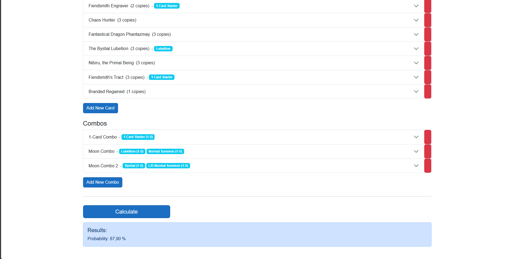

# Yu-Gi-Oh! Advanced Probability Calculator

A probability calculator for Yu-Gi-Oh! deck building that focuses on complex card combinations and interactions. Try it [here](https://ygo-calculator.pages.dev/).

## Why This Tool?

Regular hypergeometric calculation tools have limitations when it comes to calculating probabilities for decks that involve multiple ways to combo via 2-card and 3-card combos, since starters are conditional and overlap in their uses.  
This tool addresses that by using the inclusion-exclusion principle to calculate the exact probability of opening playable hands over any number of possible combos in full deck lists (as long as they don't involve random mills or draws).

## How It Works

1. **Create Categories**: Define categories that represent different card functions (e.g., "Starter", "Extender", "X", "CombosWithX").
2. **Assign Categories**: Each card can be assigned any number of categories based on its functions.
3. **Define Your Combos**: Specify which combinations of categories make your deck work.
4. **Set Requirements**: For each category and combo, you can set the minimum/maximum number of cards needed.
5. **Get Results**: The tool calculates the probability of opening any of your defined combos.

## Example: Fiendsmith Bystial Deck

This example illustrates how to calculate the likelihood of opening a Fiendsmith play by either a one-card starter or by assembling a 2-card "Moon of the Closed Heaven" combo. "Moon of the Closed Heaven" can be summoned using any two Effect Monsters. The only way to summon additional bodies that are not LIGHT Fiends in this deck is by either using Bystials or Normal Summoning. Bystials require a LIGHT or DARK monster in either GY to banish, so you must open a LIGHT or DARK Normal Summon that can be used to summon Almiraj in order to send them to the GY. Alternatively, if you searched a Bystial with Lubellion, you already have a LIGHT monster in the GY, so any Normal Summon works in that case.

### 1. Category Definitions

- **1 Card Starter**: Any single card that independently initiates a Fiendsmith combo.
- **Bystial**: Any "Bystial" monster that can summon itself.
- **Lubellion**: Specifically "The Bystial Lubellion".
- **Normal Summon**: Any monster that can be Normal Summoned (e.g., Ash Blossom & Joyous Spring).
- **L/D Normal Summon**: Any LIGHT or DARK monster that can be Normal Summoned and sent to the GY via Almiraj (e.g., Effect Veiler).

### 2. Combo Definitions

- **1-Card Combo**: Requires *any* card with the `1 Card Starter` tag.
- **Moon Combo 1**: Requires *both* the `Lubellion` tag *and* the `Normal Summon` tag in the opening hand.
- **Moon Combo 2**: Requires *both* the `Bystial` tag *and* the `L/D Normal Summon` tag in the opening hand.

After tagging all cards appropriately, this configuration will calculate the exact probability of opening a Fiendsmith play in a given deck list.

For further optimization, you could define categories like `Handtrap` or `Brick`, then require all of your combos to open at least one `Handtrap`-tagged card while opening zero `Brick`-tagged cards.  
This can help determine optimal deck sizes and engine ratios.

## Additional Features

- Import decks from `.ydk` files.
- Save and load sessions.

## Technical Details

- Built with .NET 9.0 and Blazor WebAssembly  
- Written in C# 13.0
