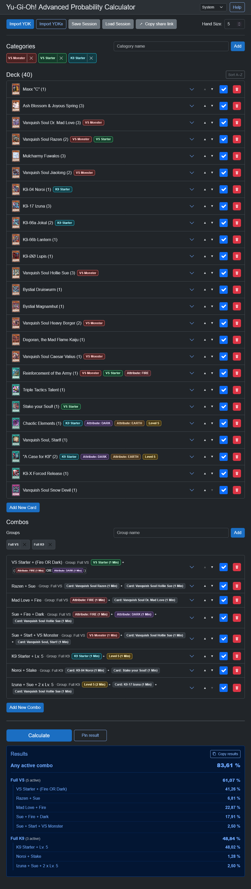

# Yu-Gi-Oh! Advanced Probability Calculator

An exact opening-hand probability calculator for Yu-Gi-Oh! decks accounting for overlapping card roles and distinct physical cards for each positive requirement.

It can model complex combo conditions while correctly accounting for hands that satisfy several combos at once.

**[Try the stable calculator](https://ygo-calculator.pages.dev/)**

> **Development preview:** This README describes the current `dev` branch. You can try that version at **[dev.ygo-calculator.pages.dev](https://dev.ygo-calculator.pages.dev/)**.



## What it can model

- **Reusable and overlapping card roles and properties** - cards can belong to several custom roles and metadata properties at once, such as `VS Starter`, `Attribute: FIRE`, or `Level 5`.
- **Exact unions of overlapping combo routes** - calculate the probability of opening any valid combo without double-counting hands that satisfy several routes, with optional grouping for related combo families.
- **Distinct physical requirements within a combo** - if a route needs both a `Starter` and a `Fire` card, one card that belongs to both does not satisfy both requirements by itself.

Results use combinatorial counting and never fall back on Monte Carlo simulation or approximation.

## Example: Vanquish Soul / K9

The included example uses a Vanquish Soul / K9 deck and models nine underlying routes as eight combo definitions. `VS Starter + (Fire OR Dark)` combines two starter routes into one OR definition. The routes either reach the full Vanquish Soul setup directly or make Ripper + Saryuja as a bridge. Half boards are intentionally not counted.

The example uses three custom role categories:

- `VS Monster`
- `VS Starter`
- `K9 Starter`

Objective properties such as FIRE, DARK, and Level 5 come from card metadata rather than separate user categories. Where a spell functionally represents one of those properties for combo modeling, the example uses a manual metadata assignment.

Cards can still satisfy several roles and properties at once. For example, Vanquish Soul Razen is both a `VS Monster` and a `VS Starter` and has the FIRE property, while Reinforcement of the Army is assigned the VS Monster and VS Starter roles with a manual FIRE property.

With all eight combo definitions active, the example has an **83.61%** probability of opening at least one modeled full-combo hand.

## How to use it

1. **Import or enter your deck.**
2. **Create custom categories** for reusable roles. Imported cards expose objective card properties automatically.
3. **Assign categories to cards.** A card can belong to multiple categories.
4. **Define combos** using categories, specific cards, or both.
5. **Set minimum and maximum counts** for each requirement.
6. **Calculate** to see the probability of each combo and the combined probability of opening any active combo.

Click **Add OR**, then click a condition or whole OR group in the expanded expression. Enter the alternative with the type and range inputs and choose **Add alternative**. Cancel target selection or alternative authoring to return to your ordinary draft. Remove alternatives using their chip crosses. For example, `Razen + (Fire OR Dark)` requires Razen and either Fire or Dark; satisfying both alternatives still counts once. Each alternative has its own Min and fixed Max or Any. Separate positive requirements still need distinct physical copies. Multiple flat OR groups are supported, with one result per combo.

## How the calculation works

The calculator uses exact combinatorial counting rather than simulation. Each combo is reduced to constraints over the physical cards that can satisfy it. Overlapping categories are normalized while still ensuring that separate positive requirements need separate card copies.

To enforce distinct physical copies across overlapping requirements, the calculator applies Hall’s matching condition to the sets of cards eligible for each requirement.

Independently of user-authored OR groups, compatible alternatives can sometimes be factored into a simpler equivalent condition:

```text
(X AND A) OR (X AND B) = X AND (A OR B)
```

When several combos overlap, compatible constraints are merged, impossible intersections are discarded, and equivalent overlaps only need to be counted once.

Because one opening hand can satisfy several combos, their probabilities cannot simply be added. The calculator uses inclusion-exclusion to avoid double-counting:

```text
P(A OR B) = P(A) + P(B) - P(A AND B)
```

The same principle extends to larger sets of combos.

Cards that behave identically for the remaining conditions are grouped together, and exact combinatorial counts are used to determine how many opening hands succeed without checking every physical hand one by one.

```text
              matching opening hands
P(success) = ------------------------
              all possible opening hands
```

## Features

- Require categories, individual cards, or both within a combo.
- Set minimum counts and either fixed maximums or `Any` (the current hand size) for requirements.
- Calculate individual combo probabilities, grouped probabilities, and the union of all active combos.
- Organize related combos into named groups.
- Import decks from `.ydk` files or YDKe deck codes.
- See automatic card thumbnails in the deck list and a larger preview in an expanded imported-card editor. Images are retained on project hosting; unavailable artwork does not affect calculations or saved sessions.
- Save and load complete calculator sessions.
- Temporarily deactivate cards and combos while testing changes.
- Reorder cards, categories, combos, and combo groups.
- Color-coded categories.
- Light, dark, and system themes.

## Technical stack

- **Blazor WebAssembly**
- **.NET 10**
- **C# 14**

## Static publishing

Release `dotnet publish` uses `BlazorWasmPreRendering.Build` to generate route-specific
`wwwroot/index.html` and `wwwroot/help/index.html` from the existing Razor pages.
The deployed site remains standalone WebAssembly. Cloudflare's existing `build.sh`
and `output/wwwroot` deployment directory remain sufficient.

After building the solution and publishing, check the initial HTML without JavaScript:

```sh
dotnet publish YGOProbabilityCalculatorBlazor/YGOProbabilityCalculatorBlazor.csproj -c Release
sh scripts/verify-published-seo.sh
```

The script runs the explicit NUnit publish-output tests using AngleSharp. For a custom
publish directory, pass its `wwwroot` path as the script's first argument.
